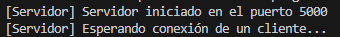
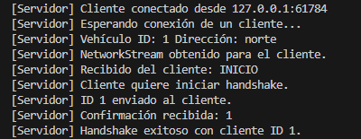
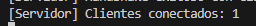

# 🚗 Simulación de tráfico en puente de un solo carril - Ejercicio 1

## 📚 Descripción

En este proyecto se simula una carretera de 100 km que tiene un puente de un solo carril entre dos puntos.  
Varios vehículos, representados por clientes, se conectan a un servidor que les asigna un ID único y una dirección aleatoria (norte o sur).  
Todo funciona mediante comunicación TCP y se usa programación concurrente para gestionar varios vehículos conectados a la vez sin bloquear el servidor.

---

## 🔥 Explicación de las etapas

### ✅ Etapa 1 - Conexión Servidor-Cliente
- Creación de un servidor que escucha en el puerto 5000.
- Creación de un cliente que se conecta al servidor.
- Mensajes de conexión mostrados por consola.

### ✅ Etapa 2 - Aceptación de Clientes
- El servidor puede aceptar múltiples clientes simultáneamente.
- Cada cliente es gestionado en un hilo independiente.

### ✅ Etapa 3 - Asignación de ID único
- Al conectarse, cada cliente recibe un identificador único.
- El servidor también asigna una dirección aleatoria ("norte" o "sur") a cada vehículo.

### ✅ Etapa 4 - Obtención de NetworkStream
- Cliente y servidor obtienen su `NetworkStream` tras la conexión.
- `NetworkStream` será utilizado para intercambiar datos.

### ✅ Etapa 5 - Métodos de Lectura y Escritura
- Implementación de métodos `EscribirMensajeNetworkStream` y `LeerMensajeNetworkStream` en una clase independiente (`NetworkStreamClass`).
- Permiten enviar y recibir mensajes tipo string de forma segura.
- Los métodos ya estaban implementados en el código proporcionado. 

### ✅ Etapa 6 - Handshake de Conexión
- Cliente inicia el handshake enviando el mensaje "INICIO".
- Servidor responde enviando el ID del vehículo.
- Cliente responde reenviando el mismo ID como confirmación.
- Handshake validado correctamente.

### ✅ Etapa 7 - Almacenamiento de Clientes
- Creación de una clase `Cliente` que almacena `Id` y `NetworkStream`.
- Gestión de una lista global de todos los clientes conectados.
- El servidor muestra en consola el número actual de clientes conectados.

---

## 🖼️ Capturas de Pantalla

- 📸 Servidor esperando clientes.

- 📸 Cliente conectado correctamente.

- 📸 Mensajes de handshake en servidor y cliente.

- 📸 Número de clientes conectados en servidor.

---

## 🚀 Estado Actual

✅ Handshake completado.  
✅ Almacenamiento de clientes activo.  
✅ Comunicación básica funcionando entre servidor y clientes.

