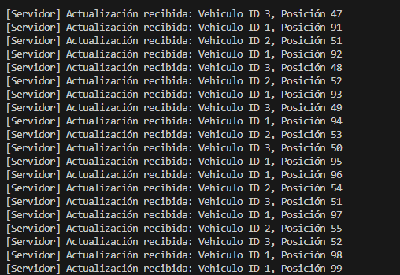
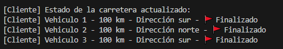
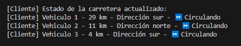

# 🚗 Simulación de tráfico en puente de un solo carril - Ejercicio 2

## 📚 Descripción

En este proyecto se continúa la simulación de una carretera de 100 km con un puente de un solo carril.  
Se ha implementado el intercambio de información en tiempo real entre todos los vehículos conectados.  
Cada cliente avanza por la carretera, envía sus actualizaciones al servidor, y el servidor reenvía el estado completo de la carretera a todos los clientes.

---

## 🔥 Explicación de las etapas

### ✅ Etapa 0 - Entendimiento de clases base
- Se analizaron las clases `Vehiculo` y `Carretera` proporcionadas en el proyecto.
- Se comprendió la estructura de datos para enviar información de los vehículos y del estado de la carretera.

### ✅ Etapa 1 - Programación de métodos para Vehiculo y Carretera
- Se implementaron los métodos `EscribirDatosVehiculoNS`, `LeerDatosVehiculoNS`, `EscribirDatosCarreteraNS` y `LeerDatosCarreteraNS` en `NetworkStreamClass`.
- Estos métodos permiten enviar y recibir objetos `Vehiculo` y `Carretera` a través del `NetworkStream` mediante serialización XML.

### ✅ Etapa 2 - Creación y envío de vehículos
- Cada cliente crea su propio vehículo al iniciar la conexión.
- El vehículo se envía al servidor para ser añadido a la carretera.

### ✅ Etapa 3 - Actualización de la posición del vehículo
- Cada cliente simula el avance de su vehículo aumentando su posición cada cierto tiempo.
- El cliente envía su nueva posición al servidor en cada movimiento.
- El servidor actualiza la información del vehículo en la carretera.

### ✅ Etapa 4 - Envío de la carretera a todos los clientes
- Cada vez que un cliente actualiza su posición, el servidor envía el estado completo de la carretera a todos los clientes conectados.
- De esta forma todos los clientes ven el avance de todos los vehículos en tiempo real.

### ✅ Etapa 5 - Recepción y visualización en el cliente
- Cada cliente tiene un hilo dedicado a escuchar las actualizaciones de la carretera desde el servidor.
- Se muestra en consola el estado de todos los vehículos, incluyendo su posición, dirección y si han finalizado el recorrido (🚩).

---

## 🖼️ Capturas de Pantalla

- 📸 Vehículos circulando por la carretera.

- 📸 Vehículo llegando a la meta.

- 📸 Cliente recibiendo las actualizaciones en tiempo real.

---

## 🚀 Estado Actual

✅ Vehículos creados y enviados correctamente al servidor.  
✅ Actualización de posiciones en tiempo real.  
✅ Carretera sincronizada en todos los clientes.  
✅ Vehículos finalizados correctamente detectados y mostrados.

